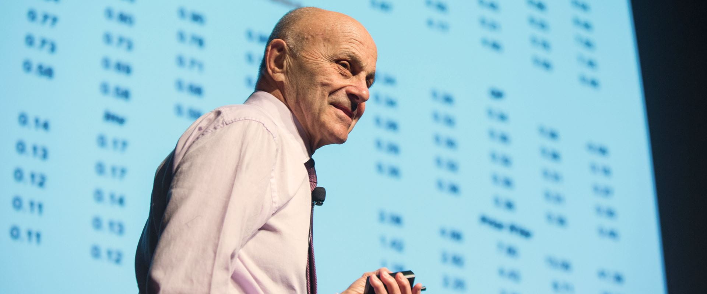

# Fama-French Three-Factor Model

다음으로 Fama-French Three-Factor Model<sup>{cite}`FAMA19933`</sup>에 대해서 간단히 설명하겠습니다.

Fama-French 모델은 Eugene Fama와 Kenneth French에 의해 1993년에 제시된 모델로, CAPM을 확장하여 자산의 수익률을 설명하는 데 두 가지 추가적인 요인을 도입했습니다. 이 모델은 시장 위험 외에도 회사의 규모, **Size**와 장부가치 대 시장가치의 비율, **Value**에 따른 위험을 고려합니다.



## 1. **Introduction**:
Fama-French 모델은 CAPM이 시장 위험만을 고려하는 반면, 자산의 수익률에 영향을 미치는 추가적인 요인들을 고려하여 더 정확한 예측을 제공하고자 합니다.

## 2. **The Formula**:
$E(R_i) = R_f + \beta_{market} (E(R_m) - R_f) + \beta_{size}(SMB) + \beta_{value}(HML)$

Where:
- $E(R_i)$ = Expected return on the asset (자산의 기대 수익률)
- $R_f$ = Risk-free rate (무위험 수익률)
- $\beta_{market}$ = Asset's sensitivity to market returns (시장 수익률에 대한 자산의 민감도)
- $SMB$ = Small Minus Big, which represents the historical excess returns of small caps over big caps. (시가총액이 작은 회사와 큰 회사 간의 수익률 차이)
- $HML$ = High Minus Low, which represents the historical excess returns of value stocks over growth stocks. (저평가된 주식과 고평가된 주식 간의 수익률 차이)

## 3. **Conceptual Understanding**:
- **SMB (Small Minus Big)**: 작은 규모의 회사와 큰 규모의 회사 간의 수익률 차이를 나타냅니다. 일반적으로 작은 규모의 회사가 큰 규모의 회사보다 더 높은 위험을 가지므로 더 높은 수익률을 기대합니다. 
  
- **HML (High Minus Low)**: 저평가된 주식, **value stocks**과 고평가된 주식, **growth stocks** 간의 수익률 차이를 나타냅니다. 이 요인은 value 주식이 growth 주식보다 장기적으로 더 높은 수익률을 제공한다는 경향을 반영합니다.

요악하자면 Fama-French 모델은 CAPM에 비해 두 가지 요인을 추가하여 자산의 수익률을 설명했습니다. 실제로 Fama French는 CAPM보다 더 높은 설명력을 보여줍니다.

CAPM에서 $E(R_i) = R_f + \beta_i (E(R_m) - R_f)$ 무위험 이자율 대비 전체 시장의 초과 기대 수익률을 독립변수 x로, 개별 자산의 기대 수익률을 종속변수 y로 하는 단순 선형 회귀 모델로 볼 수 있습니다.

그러나 CAPM의 시장 베타로는 설명되지 않는 유의미한 알파($\alpha$)가 존재하는데, 당시 이는 투자자의 주식 선택 능력으로 평가받았습니다. 그러나 이러한 알파도 투자자의 주식 선택 능력이 아닌 체계적 위험으로부터 비롯된 결과라는 가정하에 1993년 유진 파마와 케네스 프렌치는 주식수익률을 설명하고자 다변량 모델을 제안했습니다.

파마 교수는 케네스 프렌치 교수와 함께 1963년부터 1990년까지 27년에 걸친 9,500개 종목의 주가 추이를 분석한 결과를 토대로 1992년 논문에서 ‘파마-프렌치 3요인 모델’을 제시했습니다다. 파마, 프렌치 교수의 논문이 말하려는 요지는 ‘베타로 측정한 주식의 위험은 수익률을 예측할 수 있는 지표가 아니다’라는 것입니다.<sup>{cite}`python_portfolio`</sup>

```{admonition} Fama-French Three-Factor Model
“Beta as the sole variable in explaining returns on stocks is dead. <br> (주식 수익률을 설명하는 유일한 변수였던 베타는 이제 끝이다.)”
```

이후 요인 모형에 대한 분석이 활발히 이루어지고 있습니다. 2014년에는 A Five-Factor Asset Pricing Model<sup>{cite}`FAMA20151`</sup>을 발표했습니다. 계속해서 프렌치 교수의 웹사이트<sup>[프렌치 교수 웹사이트](https://mba.tuck.dartmouth.edu/pages/faculty/ken.french/data_library.html)</sup>에는 현재까지도 해당 요인 모형을 위한 데이터가 업데이트 되고 있습니다.

여기까지가 기본적인 시장에서의 요인 모형에 대한 이론적 배경입니다. 이제 우리는 KPS<sup>{cite}`KELLY2019501`</sup>를 거쳐 AAPM<sup>{cite}`GU2021429`</sup>을 이해해야 합니다. 해당 모델들은 다양한 거시경제 지표 및 시장 데이터를 활용합니다. 이 때 저자들은 단순히 요인의 수만 늘리는 것이 아닙니다. latent factor를 찾고, 그 factor의 loading을 동적으로 바꿔줌으로써 risk factor가 설명할 수 없었던 초과 수익률 $\alpha$를 전부 설명할 수 있었다고 말합니다. 즉, $\alpha$는 자산이 risk factor에 얼마나 동적으로 노출되고 있는가의 proxy에 불과했다고 말합니다.

## References
{cite}`fama_french_1992`
{cite}`FAMA19933`
{cite}`python_portfolio`
{cite}`FAMA20151`
